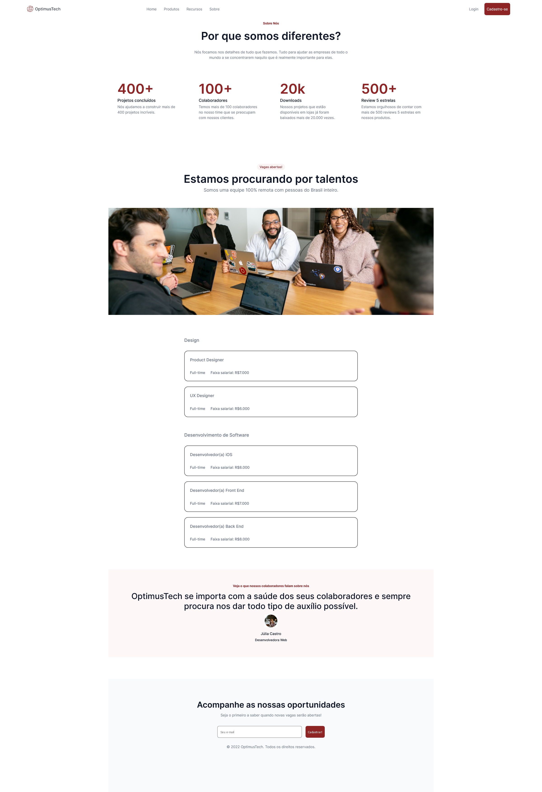
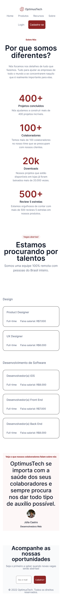

# 7 Dys of Code - #7DaysOfCode - Alura](https://7daysofcode.io/)

Esse é o projeto concluído [7 Dys of Code - #7DaysOfCode - Alura](https://7daysofcode.io/). Coloque em prática os seus conhecimentos em desafios diários 👩🏽‍💻!
. 

## Table of contents

- [Overview](#overview)
  - [The challenge](#the-challenge)
  - [Screenshot](#screenshot)
  - [Links](#links)
- [My process](#my-process)
  - [Built with](#built-with)
  - [What I learned](#what-i-learned)
  - [Continued development](#continued-development)
  - [Useful resources](#useful-resources)
- [Author](#author)
- [Acknowledgments](#acknowledgments)

**Note: Delete this note and update the table of contents based on what sections you keep.**

## Overview

### O desafio

Desenvolver uma página utilizando HTML5 e CSS3, tornando-a responsiva e acessível.

- View the optimal layout for the section depending on their device's screen size

### Screenshot

Add a screenshot of your solution. The easiest way to do this is to use Firefox to view your project, right-click the page and select "Take a Screenshot". You can choose either a full-height screenshot or a cropped one based on how long the page is. If it's very long, it might be best to crop it.

Alternatively, you can use a tool like [FireShot](https://getfireshot.com/) to take the screenshot. FireShot has a free option, so you don't need to purchase it. 

Then crop/optimize/edit your image however you like, add it to your project, and update the file path in the image above.

**Note: Delete this note and the paragraphs above when you add your screenshot. If you prefer not to add a screenshot, feel free to remove this entire section.**

### Links

- Code URL: (https://github.com/joaofelipelemos/7DaysOfCode)
- Live Site URL: (https://joaofelipelemos.github.io/7DaysOfCode/)

## Meu processo

### Construído com:

- Marcações com HTML5 semântico;
- Estilização com SASS/SCSS [https://sass-lang.com/]; 
- Flexbox;
- Desktop first;
- Design responsivo;

### Oque eu aprendi:

Utilizar os flexbox para transformar o layout responsivo;
Lidar com variáveis e tamanhos relativos;
Usar o SCSS de forma mais eficiente reaproveitando códigos nos diversos componentes;
Separar partes do conteúdo em componentes; 

### Recursos bacanas para utilizar como apoio:

- [W3Schools Online Web Tutorials](https://www.w3schools.com/)
- [Site oficial SASS](https://sass-lang.com/)
- [CodePen](https://codepen.io/)

- Github - [joaofelipelemos](https://github.com/joaofelipelemos/)
- Twitter - [@_flemos](https://www.twitter.com/_flemos_)
- Instagram - [@joaofelipelemos](https://www.instagram.com/joaofelipelemos/)